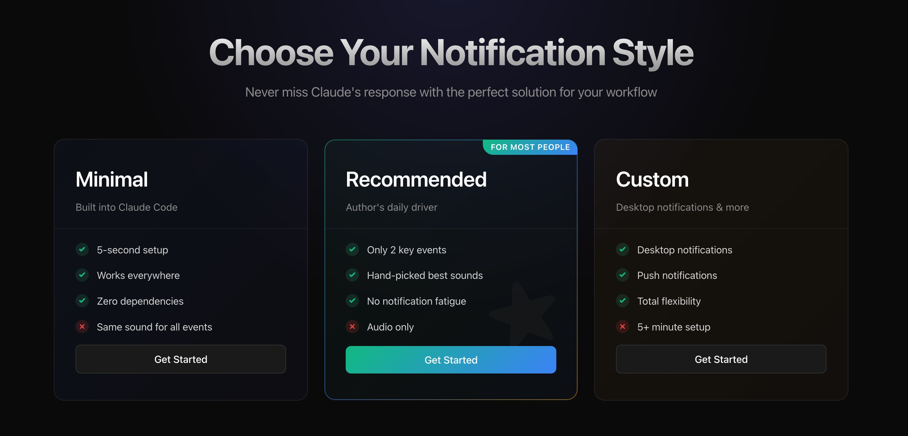

# 🔔 Claude Code Notifications

<div align="center">
  
  **Never miss Claude's response again**
  
  [](https://github.com/dongzhenye/claude-code-notifications/stargazers)
  [](LICENSE)
  [](https://github.com/dongzhenye/claude-code-notifications)
  
  *Elegant notification solutions for Claude Code CLI - from simple terminal bells to rich desktop alerts*
  
  [Quick Start](#-quick-start) • [Installation](#-installation) • [Configuration](#-configuration) • [Examples](#-examples)

</div>

---

## ✨ The Problem We Solve

Ever found yourself:
- 🤔 **Constantly switching tabs** to check if Claude has responded?
- 😔 **Missing Claude's questions** while working in another window?
- ⏰ **Wasting time** waiting when Claude has already finished?

**We've got you covered!** Choose from three notification styles that fit your workflow perfectly.

## 🎯 Choose Your Style



<div align="center">
  
  **[Minimal](#-minimal--built-in-simplicity)** • **[Recommended](#-recommended--perfect-balance)** • **[Custom](#-custom--unlimited-possibilities)**
  
</div>

## 🚀 Quick Start

**Most users should use the Recommended tier:**

```bash
# One-line installation (works anywhere - downloads configs automatically)
curl -sSL https://raw.githubusercontent.com/dongzhenye/claude-code-notifications/main/install.sh | bash
```

That's it! You now have smart audio notifications configured. 🎉

## 📋 Installation

### Prerequisites

- **Claude Code CLI** installed (`claude` command available)
- **macOS / Linux / Windows** operating system
- **Audio output** for sound notifications

### Installation Options

<details>
<summary><b>🎯 Option 1: Automatic Installation (Recommended)</b></summary>

```bash
# Download and run the installer
curl -sSL https://raw.githubusercontent.com/dongzhenye/claude-code-notifications/main/install.sh | bash
```

Or clone and run locally:

```bash
git clone https://github.com/dongzhenye/claude-code-notifications.git
cd claude-code-notifications
./install.sh
```

The installer will:
- ✅ Detect your operating system
- ✅ Automatically download configurations from GitHub (no cloning needed!)
- ✅ Apply the recommended configuration
- ✅ Create a backup of existing settings
- ✅ Provide desktop notification setup options

</details>

<details>
<summary><b>⚙️ Option 2: Manual Installation</b></summary>

1. **Choose your configuration file:**
   - macOS: `recommended/recommended.macos.json`
   - Linux: `recommended/recommended.linux.json`
   - Windows: `recommended/recommended.windows.json`

2. **Copy to Claude settings:**
   ```bash
   cp recommended/recommended.macos.json ~/.claude/settings.json
   ```

3. **Test the configuration:**
   ```bash
   # macOS
   afplay /System/Library/Sounds/Glass.aiff
   
   # Linux
   paplay /usr/share/sounds/freedesktop/stereo/message.oga
   
   # Windows (PowerShell)
   [System.Media.SystemSounds]::Asterisk.Play()
   ```

</details>

## 🎨 Configuration

### 🔵 Minimal — Built-in Simplicity

**Perfect for:** Users who want instant notifications with zero setup.

```bash
claude config set --global preferredNotifChannel terminal_bell
```

**Features:**
- ✅ **5-second setup** - Just run one command
- ✅ **Works everywhere** - Universal terminal bell
- ✅ **Zero dependencies** - Nothing to install
- ❌ **Same sound for all** - No event differentiation

<details>
<summary><b>macOS Terminal Sound Setup</b></summary>

If you don't hear the bell on macOS:
1. Open **Terminal → Preferences → Profiles**
2. Select your profile → **Advanced** tab
3. Enable **"Audible bell"**
4. Adjust volume in **System Preferences → Sound**

</details>

### ⭐ Recommended — Perfect Balance

**Perfect for:** Daily users who want smart notifications without fatigue.

**What makes it special:**
- 🎵 **Only 2 key events** - Needs input & task complete
- 🎶 **Carefully chosen sounds** - Glass (attention) & Tink (done)
- 😌 **No notification fatigue** - Designed for all-day use
- 🌍 **Cross-platform** - Works on all operating systems

**Sound Philosophy:**
```
High-frequency events (completion) → Gentle sound (Tink)
Low-frequency events (needs input) → Noticeable sound (Glass)
```

<details>
<summary><b>Configuration Details</b></summary>

The configuration maps Claude events to system sounds:

```json
{
  "hooks": {
    "Stop": [{
      "description": "Sound notification on completion",
      "hooks": [{
        "type": "sound",
        "path": "/System/Library/Sounds/Tink.aiff"
      }]
    }],
    "Notification": [{
      "description": "Sound notification when input needed",
      "hooks": [{
        "type": "sound",
        "path": "/System/Library/Sounds/Glass.aiff"
      }]
    }]
  }
}
```

</details>

### 🚀 Custom — Unlimited Possibilities

**Perfect for:** Power users who want visual notifications and advanced integrations.

**Examples included:**
- 🖥️ **Desktop notifications** with title and message
- 📱 **Push notifications** to your phone
- 🌐 **Webhook integrations** with Slack/Discord
- 🎨 **Custom scripts** for any behavior

<details>
<summary><b>Desktop Notification Example (macOS)</b></summary>

```bash
# Install terminal-notifier (if needed)
brew install terminal-notifier

# Use the provided script
cp custom/system-notify.macos.sh ~/claude-code-notifications/

# Configure in ~/.claude/settings.json
{
  "hooks": {
    "Notification": [{
      "hooks": [{
        "type": "command",
        "command": "~/claude-code-notifications/custom/system-notify.macos.sh notification"
      }]
    }]
  }
}
```

The script provides:
- 🔔 System notification center integration
- 📝 Custom titles and messages
- 🎵 Optional sound effects
- 🖼️ Claude icon in notifications

</details>

<details>
<summary><b>Create Your Own Integration</b></summary>

Create a custom script that receives the event type as first argument:

```bash
#!/bin/bash
EVENT_TYPE=$1

case "$EVENT_TYPE" in
  "notification")
    # Your code for input needed
    curl -X POST https://your-webhook.com/claude-needs-input
    ;;
  "stop")
    # Your code for task complete
    osascript -e 'display notification "Task complete!" with title "Claude"'
    ;;
esac
```

Endless possibilities:
- 🏠 Smart home integration (turn on a light)
- 📊 Log events to a database
- 🤖 Trigger other automations
- 📈 Track productivity metrics

</details>

## 🧪 Testing & Debugging

### Test System Sounds

<details>
<summary><b>🍎 macOS</b></summary>

```bash
# Test individual sounds
afplay /System/Library/Sounds/Glass.aiff
afplay /System/Library/Sounds/Tink.aiff

# Explore all available sounds
for sound in Basso Blow Bottle Frog Funk Glass Hero Morse Ping Pop Purr Sosumi Submarine Tink; do 
  echo "Playing $sound..."
  afplay "/System/Library/Sounds/$sound.aiff"
  sleep 1
done
```

</details>

<details>
<summary><b>🐧 Linux</b></summary>

```bash
# Test with PulseAudio
paplay /usr/share/sounds/freedesktop/stereo/message.oga

# Test with ALSA
aplay /usr/share/sounds/freedesktop/stereo/complete.oga

# List available sounds
find /usr/share/sounds -name "*.oga" -o -name "*.wav"
```

</details>

<details>
<summary><b>🪟 Windows</b></summary>

```powershell
# Test system sounds
[System.Media.SystemSounds]::Asterisk.Play()
[System.Media.SystemSounds]::Exclamation.Play()
[System.Media.SystemSounds]::Hand.Play()

# List available WAV files
Get-ChildItem C:\Windows\Media\*.wav | Select-Object Name
```

</details>

### Common Issues

<details>
<summary><b>🔇 No sound playing?</b></summary>

1. **Check system volume** - Ensure it's not muted
2. **Test the sound file directly** - Use commands above
3. **Verify file paths** - Ensure sound files exist
4. **Check permissions** - Some systems restrict audio playback

</details>

<details>
<summary><b>🔊 Multiple/duplicate sounds?</b></summary>

1. **Clear terminal bell:**
   ```bash
   claude config set --global preferredNotifChannel none
   ```

2. **Check for duplicate hooks:**
   ```bash
   cat ~/.claude/settings.json
   ```

3. **Use the installer's backup:**
   ```bash
   cp ~/.claude/settings.json.backup ~/.claude/settings.json
   ```

</details>

<details>
<summary><b>⚙️ Settings not applying?</b></summary>

- Settings take effect **immediately** (no restart needed)
- Check JSON syntax with `jq . ~/.claude/settings.json`
- Ensure you're editing the correct file: `~/.claude/settings.json`
- Try the automatic installer for proper configuration

</details>

## 📖 Examples

### Real-world Use Cases

**🎯 Focused Development**
```bash
# Start a long-running task
claude "Refactor this entire codebase to use TypeScript"
# Switch to email/Slack/browser
# 🔔 Get notified when Claude needs clarification
# ✅ Get notified when complete
```

**📚 Learning & Exploration**
```bash
# Ask complex questions
claude "Explain the entire architecture and create documentation"
# Go make coffee ☕
# 🔔 Return when Claude is ready
```

**🔄 Iterative Tasks**
```bash
# Multi-step processes
claude "1. Analyze code 2. Write tests 3. Fix bugs 4. Update docs"
# Work on other things
# 🔔 Get notified at each step requiring input
```

## 🛠️ Advanced Configuration

### Claude Event Types

Claude Code supports these notification events:

| Event | Description | Frequency | Recommended Sound |
|-------|-------------|-----------|-------------------|
| `Notification` | Needs user input/permission | Low | Noticeable (Glass) |
| `Stop` | Completed response | High | Gentle (Tink) |

### Hook System

The Claude Code hook system is powerful and flexible:

```json
{
  "hooks": {
    "EventName": [{
      "description": "Human-readable description",
      "hooks": [{
        "type": "sound|command",
        "path": "/path/to/sound",
        "command": "command to run"
      }]
    }]
  }
}
```

Multiple hooks can be chained for complex behaviors.

## 🤝 Contributing

We love contributions! Here's how you can help:

- 🐛 **Report bugs** - Open an issue with details
- 💡 **Suggest features** - Share your ideas
- 🔧 **Submit PRs** - Improvements welcome
- 📖 **Improve docs** - Help others get started
- ⭐ **Star the repo** - Show your support

## 📄 License

MIT License - see [LICENSE](LICENSE) file for details.

## 👨‍💻 Author

Created with ❤️ by [Zhenye Dong](https://github.com/dongzhenye)

---

<div align="center">
  
  **If this tool saves you time, please consider giving it a ⭐**
  
  [Report Bug](https://github.com/dongzhenye/claude-code-notifications/issues) • [Request Feature](https://github.com/dongzhenye/claude-code-notifications/issues)
  
</div>